# Shell-scripting

## Introduction to Shell Scripting and User Input

In our git course, we have been writing commands on the terminal and getting corresponding output. The commands are
instructions to the computer to carryout certain task. For instance, when we want to clone a git repo, we type the command git clone and pass in the link to the repository. In less than no time we see the repo downloaded into our local machine.

Lets say you are given a task to clone 1000 repositories. Yes you can type the git clone command 1000 times. That gets the job done. Someone with not so great patience maybe unable to complete the task.

This is where shell scripting commes in. Shell scripting helps you automate repetitive task. We can simply write a script that does the job of cloning the 1000 repositories. We call it once and the job is done. We have the advantage of using it again whenever we are signed same task.
Bash scripts are essentially a series of commands and instructions that are executed sequentially in a shell. You can create a shell script by saving a collection of commands in a text file with a .sh extension. These scripts can be executed directly from the command line or called from other scripts.

## Shell Scripting Syntax Elements

1. Variables: Bash allows you to define and work with variables. Variables can store data of various types such as
numbers, strings, and arrays. You can assign values to variables using the = operator, and access their values using
the variable name preceded by a $ sign.

- Example: Assigning value to Variable

`NAME="John`

- Example: Assigning value to Variable

`echo $NAME`

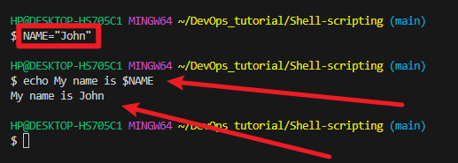

2. Control Flow: Bash provides control flow statements like if-else, for loops, while loops, and case statements to control the flow of execution in your scripts. These statements allow you to make decisions, iterate over lists, and execute different commands based on conditions.

- Example: Using if-else to execute script based on a conditions

#!/bin/bash

# Example script to check if a number is positive, negative, or zero

`read -p "Enter a number: " num`

`if [ $num -gt 0 ]; then`
    `echo "The number is positive."`
`elif [ $num -lt 0 ]; then`
    `echo "The number is negative."`
`else`
    `echo "The number is zero."`
`fi`

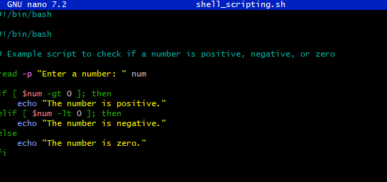

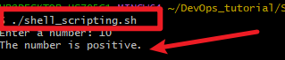

The piece of code prompts you to type a number and prints a statement stating the number is positive or negative.

- Example: Iterating through a list using a for loop

`for (( i=1; i<=5; i++ ))`
`do`
`echo $i`
`done`
`The result is`

The result is:

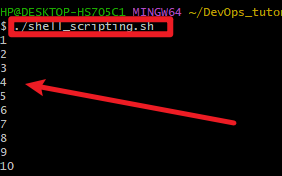

3. Command Substitution:

 Command substitution allows you to capture the output of a command and use it as a value
within your script. You can use the backtick or the $()syntax for command substitution.

- Example: Using backtick for command substitution

`today=`date`

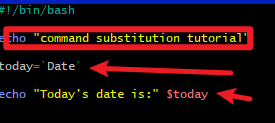

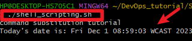

- Example: Using $() syntax for command substitution

`today=$(date)`

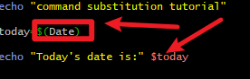

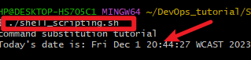

4. Input and Output: 

Bash provides various ways to handle input and output. You can use the read command to accept user input, and output text to the console using the echo command. Additionally, you can redirect input and output using operators like > (output to a file), < (input from a file), and | (pipe the output of one command as input to another).

- Example: Accept user input

`echo "Enter your name:"`
`read name`

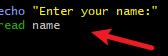

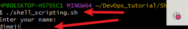

Example: Output text to the terminal

`echo "Hello World"`

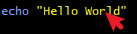

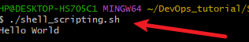

- Example: Out the result of a command into a file

`echo "hello world" > index.txt`

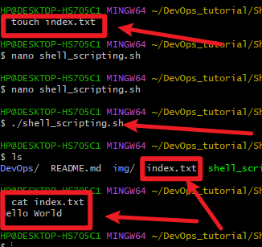

Example: Pass the content of a file as input to a command

`grep "pattern" < input.txt`

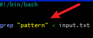

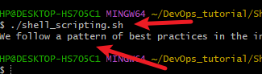

Example: pass the result of a command as input to another command

`echo "hello world" | grep "pattern"`

5. Functions:
Bash allows you to define and use functions to group related commands together. Functions provide a way to modularize your code and make it more reusable. You can define functions using the function keyword or simply by declaring the function name followed by parentheses.

`#!/bin/bash`

# Define a function to greet the user

`greet() {echo "Hello, $1! Nice to meet you."}`

## Call the greet function and pass the name as an argument

`greet "John"`

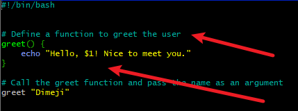

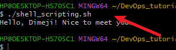

## Lets write our First Shell Script

step 1: On your terminal, open a folder called shell-scripting using the command mkdir shell-scripting . This will hold all
the script we will write in this lesson.

step 2: create a file called user-input.sh using the command touch user-input.sh

step 3: Inside the file copy and paste the block of code below:
#!/bin/bash

## Prompt the user for their name
echo "Enter your name:"
read name
## Display a greeting with the entered name

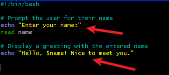

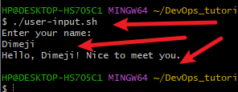

A liitle bit about the code block. The script prompts for your name. When you type your name, it displays the text hello !
Nice to meet you. Also #!/bin/bash helps you specify the type of bash interpreter to be used to execute the script.

step 4: save your file

step 5: Run the command sudo chmod +x user-input.sh this makes the file executable

step 6: Run the script using the command ./user-input.sh
Additional Resources

If you like text based learning material, this guide will be of help Learn-Shell-Scripting

## Directory Manipulation and Navigation

On the back of your lessons on Directory Manipulation and Navigation of Linux file system, We will be writing a simple
shell script as a way of practicing what we learnt.
This script will display the current directory, create a new directory called "my_directory," change to that directory, create
two files inside it, list the files, move back one level up, remove the "my_directory" and its contents, and finally list the filesin the current directory again.

Proceed by following the steps bellow:

step 1: open a file named navigating-linux-filesystem.sh

step 2: paste the code block below into your file.

`#!/bin/bash`

##  Display current directory

`echo "Current directory: $PWD"`

## Create a new directory

`echo "Creating a new directory..."`

`mkdir my_directory`

`echo "New directory created."`

## Change to the new directory

`echo "Changing to the new directory..."`

`cd my_directory`

`echo "Current directory: $PWD"`

## Create some files

`echo "Creating files..."`

`touch file1.txt`

`touch file2.txt`

`echo "Files created."`

## List the files in the current directory

`echo "Files in the current directory:"`

ls
## Move one level up

`echo "Moving one level up..."`

cd ..

`echo "Current directory: $PWD"`

## Remove the new directory and its contents

`echo "Removing the new directory..."`

`rm -rf my_directory`

`echo "Directory removed."`

## List the files in the current directory again

`echo "Files in the current directory:"`

`ls`
step 3: Run the command sudo chmod +x 

`navigating-linux-filesystem.sh`o set execute permission on the file

step 4: Run your script using this command ``./navigating-linux-filesystem.sh``

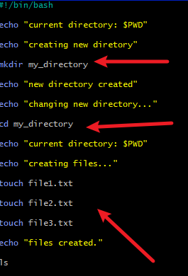

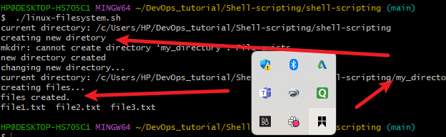

# File Operations and Sorting

In this lesson, we will be writing a simple shell script that focuses on File Operations and Sorting.

This script creates three files (file1.txt, file2.txt, and file3.txt), displays the files in their current order, sorts them alphabetically, saves the sorted files in sorted_files.txt, displays the sorted files, removes the original files, renames the sorted file to sorted_files_sorted_alphabetically.txt, and finally displays the contents of the final sorted file.

Lets proceed using the steps below

#!/bin/bash

## Create three files

echo "Creating files..."

echo "This is file3." > file3.txt

echo "This is file1." > file1.txt

echo "This is file2." > file2.txt

echo "Files created."

## Display the files in their current order

echo "Files in their current order:"
ls

## Sort the files alphabetically

echo "Sorting files alphabetically..."

ls | sort > sorted_files.txt

echo "Files sorted."

## Display the sorted files

echo "Sorted files:"

cat sorted_files.txt

## Remove the original files

echo "Removing original files..."

rm file1.txt file2.txt file3.txt

echo "Original files removed."

## Rename the sorted file to a more descriptive name

echo "Renaming sorted file..."

mv sorted_files.txt sorted_files_sorted_alphabetically.txt

echo "File renamed."

## Display the final sorted file

`echo "Final sorted file:"`

`cat sorted_files_sorted_alphabetically.txt`

step 3: Set execute permission on sorting.sh using this 

`command sudo chmod +x sorting.sh`

step 4: Run your script using the command `./sorting.sh`

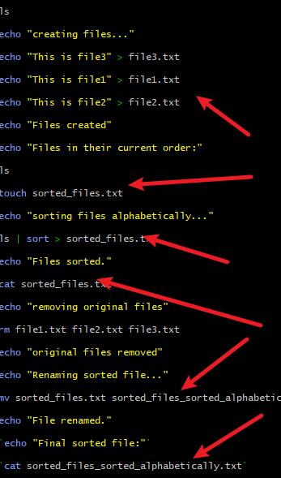

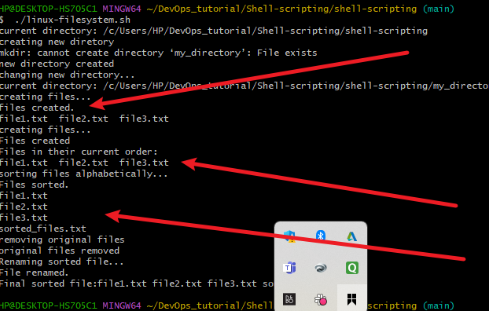

# Working with Numbers and Calculations

This script defines two variables num1 and num2 with numeric values, performs basic arithmetic operations (addition,
subtraction, multiplication, division, and modulus), and displays the results. It also performs more complex calculations such as raising num1 to the power of 2 and calculating the square root of num2, and displays those results as well.

Lets proceed by following the steps below:

step 1: On your terminal create a file called `calculations.sh` using the command touch calculations.sh

step 2: Copy and paste the code block below:

`#!/bin/bash`

# Define two variables with numeric values

num1=10

num2=5
## Perform basic arithmetic operations

sum=$((num1 + num2))

difference=$((num1 - num2))

product=$((num1 * num2))

quotient=$((num1 / num2))

remainder=$((num1 % num2))

## Display the results

echo "Number 1: $num1"

echo "Number 2: $num2"

echo "Sum: $sum"

echo "Difference: $difference"

echo "Product: $product"

echo "Quotient: $quotient"

echo "Remainder: $remainder"

## Perform some more complex calculations

power_of_2=$((num1 ** 2))

square_root=$(echo "sqrt($num2)" | bc)

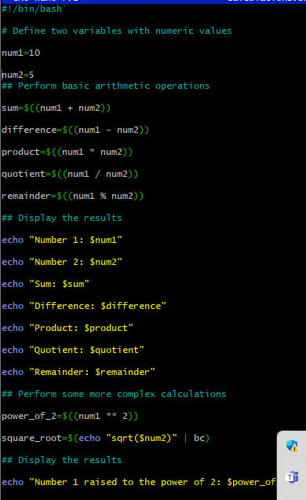

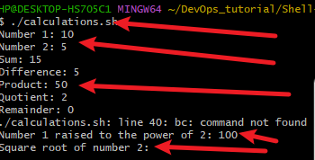

## Display the results

echo "Number 1 raised to the power of 2: $power_of_2"

echo "Square root of number 2: $square_root"

step 3: Set execute permission on calculations.sh using the command: sudo chmod +x calculations.sh

step 4: Run your script using this command: ./calculations.sh

# File Backup and Timestamping

This shell scripting example is focused on file backup and timestamp. As a DevOps Engineer backing up databases and
other storage devices is one of the most common task you get to carryout.

This script defines the source directory and backup directory paths. It then creates a timestamp using the current date and
time, and creates a backup directory with the timestamp appended to its name. The script then copies all files from the
source directory to the backup directory using the cp command with the -r option for recursive copying. Finally, it displays
a message indicating the completion of the backup process and shows the path of the backup directory with thetimestamp.

Lets proceed using the steps bellow:

step 1: On your terminal open a file backup.sh using the command touch backup.sh
step 2: Copy and paste the code block below into the file.

`#!/bin/bash`

## Define the source directory and backup directory

`source_dir="/path/to/source_directory"`

`backup_dir="/path/to/backup_directory"`

## Create a timestamp with the current date and time

`timestamp=$(date +"%Y%m%d%H%M%S")`

## Create a backup directory with the timestamp

`backup_dir_with_timestamp="$backup_dir/backup_$timestamp"`

## Create the backup directory

`mkdir -p "$backup_dir_with_timestamp"`

## Copy all files from the source directory to the backup directory

`cp -r "$source_dir"/* "$backup_dir_with_timestamp"`

## Display a message indicating the backup process is complete

`echo "Backup completed. Files copied to:` 

`$backup_dir_with_timestamp"`

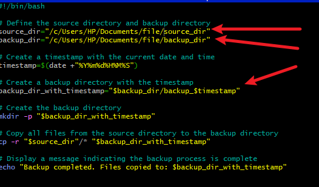

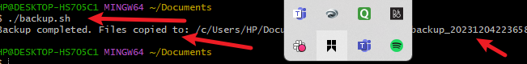

step 3: Set execute permission on backup.sh using this command 

`sudo chmod +x backup.sh`

step 4: Run your script using the command: `./backup.sh`
